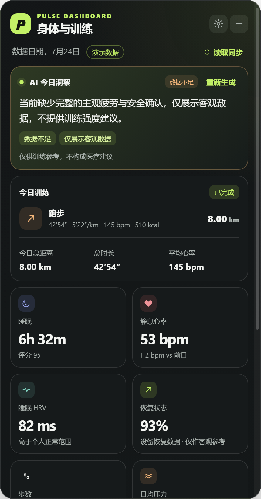
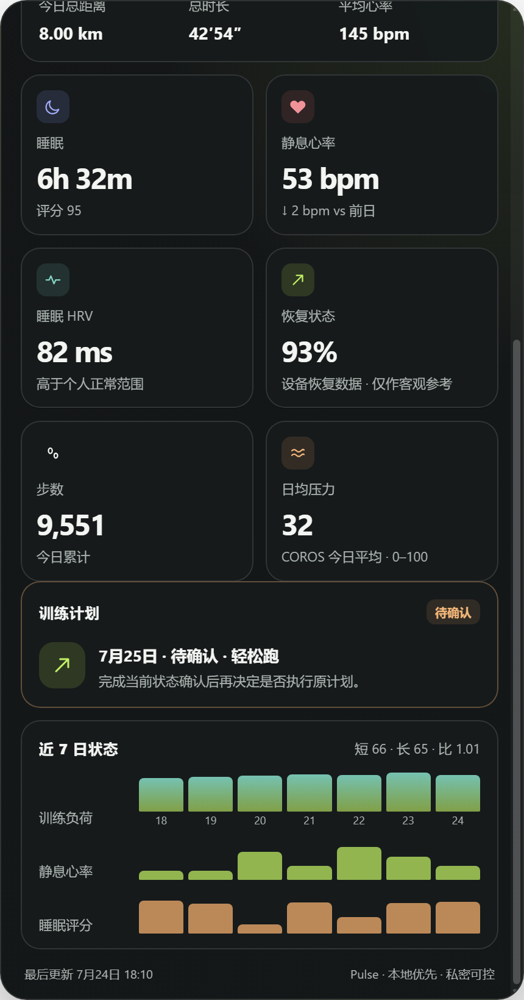
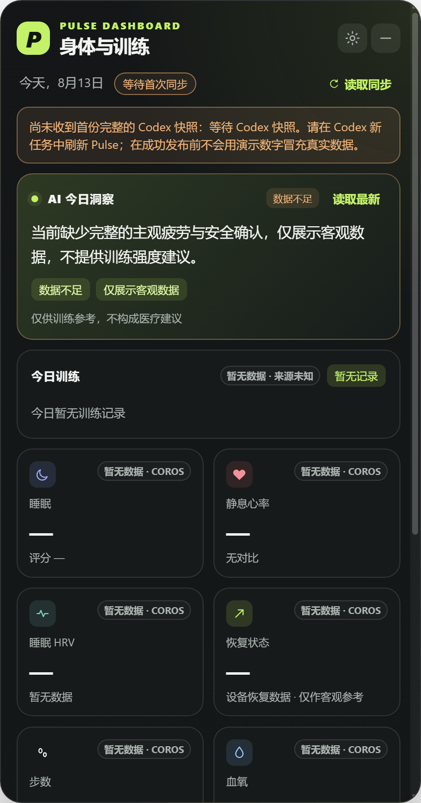
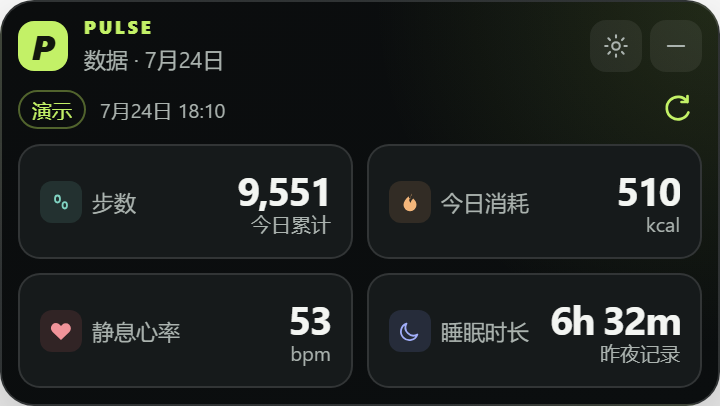
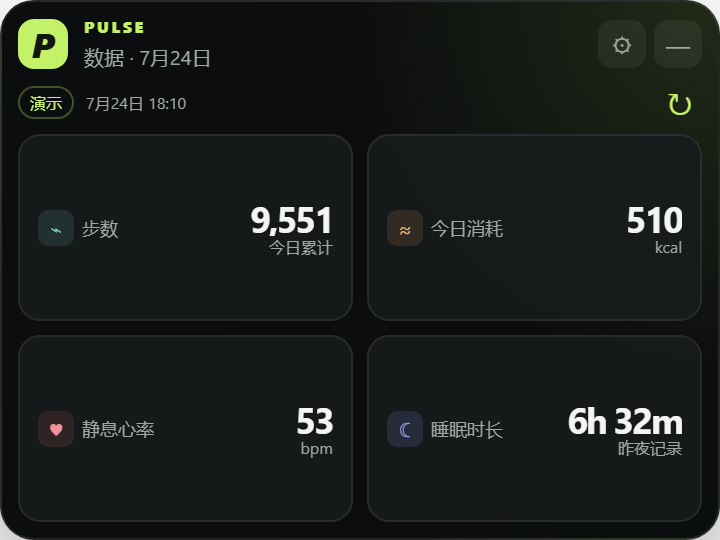
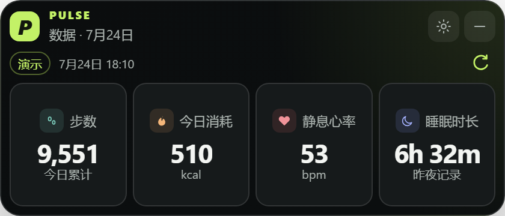

# Pulse Dashboard

Pulse 是一个由 Codex 宿主驱动的 Windows 健康与训练桌面看板。Codex 通过用户已经连接并授权的 COROS MCP 读取数据、生成训练洞察，再将经过归一化和脱敏的快照交给 Pulse 在桌面卡片中展示。

> **公开版本：v0.5.5 Beta；当前源码：v0.5.6 候选（尚未发布）**。这是可运行的公开测试项目，不是官方 COROS 客户端，不是独立数据监测 App，也不是医疗产品。真实数据更新仍需从 Codex 任务发起；桌面上的“读取同步”只重读本机已有快照。Desktop 与 Codex 插件必须使用同一发布版本，详见[版本兼容性](docs/VERSION_COMPATIBILITY.md)。

## 展示效果

以下图片仅包含仓库内的合成演示数据或首次同步空状态，不含真实用户健康信息。

<table>
  <tr>
    <td width="50%">
      
      <br><sub>安全覆盖后的桌面总览：高设备恢复值不等于训练许可</sub>
    </td>
    <td width="50%">
      
      <br><sub>安全覆盖后的健康、待确认训练计划与最近七日训练负荷</sub>
    </td>
  </tr>
  <tr>
    <td colspan="2">
      
      <br><sub>真实数据模式首次同步前：明确显示空值，不用演示数字冒充真实结果</sub>
    </td>
  </tr>
</table>

演示快照故意同时包含较高的设备恢复等级和不完整的主观安全确认。界面保留 93% 这个客观设备数值，但会将恢复说明改为“仅作客观参考”，隐藏训练负荷与执行性计划详情，并显示“待确认”，用于验证安全覆盖确实生效。

### 简洁小组件模式

小组件只显示步数、今日已记录活动消耗、静息心率和睡眠时长。21:9 模式将四项指标横向排列；16:9 和 4:3 模式采用两列卡片布局。以下截图使用合成演示数据：

<table>
  <tr>
    <td width="33%"><br><sub>16:9</sub></td>
    <td width="33%"><br><sub>4:3</sub></td>
    <td width="34%"><br><sub>21:9 超宽版</sub></td>
  </tr>
</table>

## 它能做什么

- 展示睡眠时长与评分、静息心率、睡眠 HRV、恢复状态、步数、日均压力等指标；旧格式快照没有压力字段时兼容显示血氧。
- 展示今日训练的距离、时长、配速、平均心率、热量，以及当天或下一次训练计划。
- 展示当前短期/长期训练负荷、负荷比值和最近七日逐日趋势。
- 由 Codex 综合至少两个有效健康信号、训练完成情况和计划，生成简洁的 AI 今日洞察；只有最终安全状态为 `ready` 时才透传训练执行建议。
- 提供无边框圆角窗口、拖动、置顶、背景层透明度、深浅主题、紧凑模式、托盘和开机启动选项；完整模式会记住窗口位置和尺寸，并在显示器工作区内恢复。
- 提供简洁小组件模式：以 16:9（360×203）、4:3（360×270）或 21:9（420×180）横版小窗，只显示步数、当天已记录活动消耗、静息心率和睡眠时长。
- 在 Bridge 暂时不可用时保留同一数据来源的最后一份完整快照；不完整数据、零时长跑步和明显乱码不会覆盖旧快照。
- 提供独立的合成演示模式，用于检查布局和交互，不连接真实账户。
- 候选发布流程固定 GitHub Actions 到完整提交，生成安装包 SHA-256、SPDX SBOM 与 GitHub 构建/SBOM 证明；当前安装包仍未代码签名。

## 它不是什么

- **不是独立 COROS 客户端**：Pulse 没有 COROS OAuth、账户登录、Token 管理或供应商 API 直连能力。
- **不是无感后台采集器**：Electron 进程不能继承 Codex 任务中的 MCP 权限，也不会绕过 Codex 直接查询 COROS。
- **不是实时监护设备**：显示的是最近一次成功生成的快照，不是连续生命体征流。
- **不是医疗工具**：AI 洞察仅供训练参考，不构成诊断、治疗或医疗建议。
- **不是 COROS 官方产品**：COROS 名称及相关商标归其权利人所有。

### 训练建议的安全边界

Pulse 将设备恢复值、HRV、负荷比和其他可穿戴指标视为参考输入，而不是训练许可或医疗判断。只有可信、当前、完整的快照通过主观安全确认时，界面才会显示训练执行建议；`data_insufficient` 会隐藏强度、训练负荷和执行性计划详情，`stop_refer` 会停止训练建议，并在症状持续或加重时提示寻求适当的专业评估。

最终 `readiness` 状态统一控制 AI 洞察、恢复提示和训练计划。未知或畸形状态默认按 `data_insufficient` 处理；重新生成洞察的成功或失败回调也不能覆盖较新的安全状态。客观指标和已经完成的活动仍可见，但不代表已经获得训练许可。

## 数据如何更新

```text
COROS MCP → Codex Pulse 插件 → 127.0.0.1 Handoff → Pulse 桌面看板
```

1. Pulse 在设置中选择“Codex + COROS MCP”，并在本机启动只监听 `127.0.0.1:19091` 的 Handoff。
2. 用户在新的 Codex 任务中输入：`刷新我的 Pulse 今日健康与训练快照`。
3. Pulse 插件调用当前 Codex 中已经连接并授权的 COROS MCP，读取健康、睡眠、恢复、活动、计划和负荷数据。
4. 插件先执行完整性与 UTF-8 质量检查，再将规范化 JSON 发布给本机 Handoff。
5. Pulse 收到成功事件后立即重读并渲染；无需再点击一次按钮。

桌面右上角的“读取同步”、托盘中的“读取最新同步”和设置里的 1–60 分钟间隔，都只检查**本机是否出现了新快照**。它们不会新建 Codex 任务，也不会主动调用 COROS。生成新的即时数据仍需第 2 步。

## 安装公开 Beta

### 1. 安装 Windows 桌面版

当前公开安装组合是 v0.5.5 Beta。从 [GitHub Releases](https://github.com/gronbow/pulse-dashboard/releases/tag/v0.5.5-beta) 下载 `Pulse-Dashboard-Setup-0.5.5-x64.exe`。

要求：

- Windows 10/11 x64。
- 安装包当前未做代码签名，Windows SmartScreen 可能显示警告；请只从本仓库 Release 下载，并核对 Release 中的 SHA-256。
- 桌面安装包已包含运行环境，普通安装不需要另装 Node.js。

### 2. 安装 Codex 插件

在可使用 Codex CLI 的终端执行：

```powershell
codex plugin marketplace add gronbow/pulse-dashboard --ref v0.5.5-beta
codex plugin add pulse-dashboard@pulse-dashboard
```

然后新建一个 Codex 任务，使新安装的插件被加载。不要把 v0.5.5 Desktop 与 `main` 分支插件混用；`main` 当前是采用新版 Handoff 认证协议的 v0.5.6 开发候选。当前公开流程以 `codex-cli 0.145.0-alpha.30` 验证；Codex 仍在迭代，后续版本的插件命令可能变化。

### 3. 连接并刷新

1. 启动 Pulse，在设置中选择“Codex + COROS MCP”并保存。
2. 确认同一 Codex 环境已经连接并授权 COROS MCP。
3. 在新的 Codex 任务中说：`刷新我的 Pulse 今日健康与训练快照`。
4. Codex 报告发布成功后，Pulse 会自动更新。

若只想预览 UI，在设置中选择“演示数据”即可；演示模式与真实数据模式有清晰标识。

如果只需要快速查看基础状态，可在设置中打开“简洁小组件模式”，并选择 16:9、4:3 或 21:9 比例。21:9 模式会将四项指标横向排列；16:9 和 4:3 模式会将指标按两列排列，并把数值靠右对齐以减少卡片内留白。小组件中的“今日消耗”是当天已记录活动的卡路里汇总，不代表全天总能量消耗；没有有效活动热量时显示“—”。

## 当前限制

| 项目 | v0.5.5 Beta 的实际状态 |
| --- | --- |
| COROS 数据权限 | 由 Codex 中已连接的 COROS MCP 提供；仓库和安装包不提供 COROS 接口或授权。 |
| 刷新方式 | 新查询必须在 Codex 任务中触发；桌面按钮与定时间隔只重读本机快照。 |
| 后台自动化 | 默认不创建 Codex 定时任务，因为这类运行会留下可见任务记录，无法做到完全无感。 |
| 数据新鲜度 | 取决于 COROS MCP 返回内容和最近一次成功发布的时间；当天未归档指标可能显示带真实日期的最近有效值。 |
| 缺失数据 | 使用 `—`、`null`、空数组或明确提示，不用 `0` 或 Demo 数据补齐真实模式。 |
| 平台 | 目前仅构建并验证 Windows x64；没有 macOS/Linux 安装包。 |
| 安装签名 | 当前 Beta 未签名，可能触发 SmartScreen；尚未提供自动更新。 |
| 本机存储 | 规范化快照使用 Windows 当前用户的系统加密能力保存；默认留存 7 天，可选 1 / 7 / 30 天，并可在设置中一键清除。 |
| 性能 | 本机发布候选采样约 0.31% 单核、约 404 MB 总工作集；CPU 达标，Electron 内存仍高于原 150 MB 目标。 |
| 多平台/多品牌 | 架构保留适配层，但本 Beta 只验证 Codex + COROS MCP 路径。 |
| 自定义 Bridge | 仅用于本机开发兼容；无 Handoff 身份认证，不发送快照生成洞察，也不允许其提供训练强度结论。 |
| AI 建议 | 客观数据可单独刷新；缺少当前主观安全确认时标记“数据不足”且不提供训练强度。疼痛、胸部症状或头晕会触发停止训练安全路径；不能代替教练或医生。 |

## 隐私与安全边界

- Handoff 和自定义 HTTP Bridge 都只允许 `localhost`、`127.0.0.1` 或 IPv6 loopback，不向局域网开放。
- Handoff 使用随机挑战确认固定端口上的服务身份，并以当前用户随机令牌保护快照和洞察接口。
- Electron 会话默认拒绝权限请求；Preload 不向页面暴露 IPC 事件对象，打包版关闭 Node/调试环境入口并强制 ASAR 完整性。
- Pulse 不保存 COROS 密码、Token、Cookie、原始 MCP 响应、活动内部 ID 或坐标。
- 公开仓库只提交合成快照和空状态截图；`.fit`、GPX/TCX/KML、运行缓存、私有配置和训练计划目录均被排除并接受自动审计。
- 快照发布前至少需要两个有效健康信号；有距离的活动必须有正时长。AI 洞察若生成失败会在独立状态栏提示，不会覆盖安全提示，也不会阻断已通过校验的客观数据更新。
- 新快照必须具有有效且不过期的时间戳和显式 `readiness`；看板会显示数据覆盖与建议可信度，主观安全输入不完整时不得给训练强度。
- 静态快照使用 Windows 系统加密，但无法抵御已经控制当前 Windows 账户或读取进程内存的恶意软件。

完整字段和接口约定见 [Bridge Contract](docs/BRIDGE_CONTRACT.md)，Codex 插件说明见 [Codex Plugin](docs/CODEX_PLUGIN.md)，本机数据边界见 [隐私说明](docs/PRIVACY.md) 与 [威胁模型](docs/THREAT_MODEL.md)。

## 从源码运行与验证

开发环境需要 Node.js 20+：

```powershell
npm install
npm start
```

常用验证：

```powershell
npm test
npm run audit:history
npm run audit:dependencies
npm run audit:production
npm run test:desktop
npm run test:workflows
npm run test:ci
npm run test:release
npm run dist:win
```

- `npm test` 覆盖快照归一化、Bridge/Handoff、UTF-8、发布质量门、公开插件包、隐私审计和 Windows 图标。
- `npm run audit:history` 扫描当前待发布分支可达历史，避免旧提交泄露个人路径、活动 ID 或凭据形态内容。
- `npm run audit:dependencies` 直接检查锁文件中的完整依赖集合；`audit:production` 再以省略开发依赖的口径复核，两项都不依赖本机 `node_modules` 的偶然状态。
- `npm run test:ci` 覆盖数据链、隐私、Git 历史、依赖审计，以及总览、三种小组件、浅色长文本、次要健康卡片和无数据状态的真实 Electron 渲染；小组件分别检查 100%、125% 和 150% 缩放。
- `npm run test:workflows` 断言外部 Actions 使用完整提交固定，并检查依赖审查、SBOM、校验和与构建证明门。
- `npm run test:release` 在 `test:ci` 基础上验证已打包 EXE；运行前需先执行 `npm run pack:win` 或 `npm run dist:win`。
- 构建采用文件白名单，桌面安装包不会包含本地训练文件、缓存或插件开发目录。

发布验收、已知限制和安装包校验记录见 [v0.5.5 发布候选审计](docs/V0.5.5_RELEASE_AUDIT.md)，当前未发布变化见 [v0.5.6 Candidate Notes](docs/RELEASE_NOTES_V0.5.6_CANDIDATE.md)，供应链核验见 [Supply Chain](docs/SUPPLY_CHAIN.md)，后续方向见 [Roadmap](docs/ROADMAP.md)。

## 项目状态与反馈

这是跑步数据项目的首个公开桌面 Beta，当前优先验证“Codex + COROS MCP → 桌面看板”的完整闭环。欢迎通过 [Issues](https://github.com/gronbow/pulse-dashboard/issues) 报告问题；请勿上传真实健康快照、FIT 文件、坐标、Token、活动 ID 或包含个人信息的日志。

## License

[MIT](LICENSE)。第三方数据源名称和商标归其所有者所有；Pulse 与 COROS 或其他可穿戴平台不存在官方隶属或背书关系。
