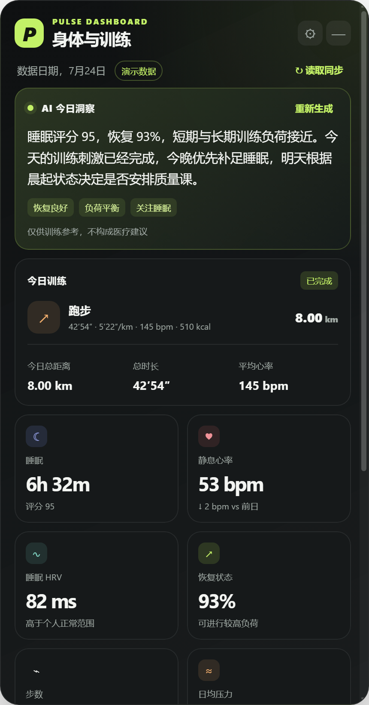

# Pulse：AI 健康教练桌面看板

Pulse 是一个由大模型宿主驱动的桌面数据看板，用于在电脑桌面展示身体状态、今日训练、训练计划和 AI 洞察。首个宿主是 Codex：Codex 调用已授权的 COROS MCP，Pulse 负责把标准化结果渲染为真正的桌面卡片。



> 截图仅使用仓库内的合成演示数据，不包含真实用户健康信息。

## 当前版本

桌面端 v0.5.4 Beta 已跑通并加固这条数据链路：

```text
COROS MCP → Codex Pulse 插件 → 本机 Codex Handoff → Pulse 桌面看板 → AI 训练建议
```

- 无边框、圆角、可拖动桌面窗口，支持托盘、置顶、透明度和主题；Windows 托盘与任务栏均显式使用 Pulse 多尺寸原生图标。
- 健康卡片：睡眠、睡眠评分、静息心率、睡眠 HRV、恢复状态、步数、日均压力和训练负荷；当天尚未生成某项指标时，可显示带日期的最近有效值。
- 训练卡片：距离、时长、配速、心率、热量和训练计划。
- 近 7 日状态卡片展示逐日短期训练负荷，并同时保留当前短期负荷、长期负荷和比值。
- 支持演示数据、Codex + COROS MCP 和自定义 HTTP Bridge；含缓存和离线回退。
- Codex 发布完整快照后，桌面窗口会立即自动读取；不需要再点一次刷新。
- 只有主动选择“演示数据”时才显示合成数字；Codex/Bridge 尚无真实快照和同源缓存时显示明确空状态。
- 不完整健康信号、零时长跑步和乱码会在覆盖旧快照前被拒绝。
- Electron 不保存 COROS 密码、Token 或供应商 API 配置。

v0.5.2 修复 Windows 托盘空白图标，v0.5.3 修复源码开发态继承 Electron 默认任务栏图标的问题，v0.5.4 增加面向伏案人群的日均压力卡片，并在压力缺失时回退显示血氧。旧快照仍兼容。

## 运行

需要 Node.js 20+。

```powershell
npm install
npm start
```

首次启动默认使用合成演示数据。它仅用于检查布局和交互，不连接真实账户。

## 测试 Codex 桌面闭环

1. 启动 Pulse，在右上角设置中把数据源改为“Codex + COROS MCP”。
2. 在 Codex 中安装 / 更新本仓库自带的 `pulse-dashboard` 插件，并新开一个任务以载入新版本。
3. 在当前任务中让 Pulse 刷新今日快照。Codex 会调用已授权的 COROS MCP，并把规范化快照仅发布给本机 Handoff。
4. 发布成功后，Pulse 窗口会立即自动更新。右上角“读取同步”只是手动重读本机最新快照的备用入口。

桌面端的自动读取只检查本机是否出现新快照，不会创建 Codex 任务，也不会直接访问 COROS。现阶段每次新的 MCP 查询仍必须发生在 Codex 任务中；Codex 的独立计划任务会产生可见运行记录，因此项目默认不启用这类定时同步。

Handoff 只监听 `http://127.0.0.1:19091`，不对局域网开放。完整交接说明见 [桌面交接约定](docs/BRIDGE_CONTRACT.md)，插件使用说明见 [Codex 插件说明](docs/CODEX_PLUGIN.md)。

## 自定义 HTTP Bridge

如需验证通用协议，可运行：

```powershell
npm run bridge:demo
```

然后在设置中选择“自定义 HTTP Bridge”，填写 `http://127.0.0.1:19090`。Bridge 需要提供：

- `GET /api/health`
- `GET /api/snapshot?timezone=Asia%2FShanghai`
- `POST /api/insight`，请求体为 `{ "snapshot": { ... } }`

## 隐私与产品边界

- `src/mock/snapshot.json` 是合成演示数据，不是个人健康数据。
- `.fit` 文件、环境变量、私有数据目录和本地配置默认不进入 Git。
- Pulse 不开发独立 COROS OAuth、Token 管理或供应商 API 直连；授权和工具调用属于 LLM Host。
- AI 洞察仅供训练参考，不构成医疗建议。
- 商标清查、申请、应用上架和正式发布在测试版真实数据闭环稳定后再评估。

## 验证与 Windows 测试包

```powershell
npm test
npm run audit:production
npm run test:desktop
npm run pack:win
npm run dist:win
```

- `npm test` 检查数据归一化、Handoff、UTF-8 发布和当前公开文件隐私。
- `npm run test:tray` 会在开发态真实创建 Windows 托盘对象，并检查图标不是空图或透明占位图。
- `npm run test:window-icon` 会在开发态检查 Windows 窗口图标与 `AppUserModelID` 已绑定到 Pulse。
- `npm run test:packaged` 会直接启动 `release/win-unpacked/Pulse Dashboard.exe`，复测随包图标、托盘和窗口身份。
- `npm run test:desktop` 启动真实 Electron 窗口并生成本地截图。
- `npm run test:secondary-health` 分别断言压力卡片和旧快照血氧回退，不只检查截图是否生成。
- `npm run test:unavailable` 断言 Codex 首次同步前全部健康值为空，不会回退到 Demo。
- `npm run test:release` 汇总源码、桌面渲染、已打包程序和生产依赖审计；运行前需先构建解包版。
- `npm run pack:win` 生成未安装目录；`npm run dist:win` 生成未签名的 Windows 测试安装包。
- 构建使用严格文件白名单，不会把本地 `.fit`、训练计划、运行缓存或插件开发文件打进桌面安装包。

如果中国大陆网络无法从 GitHub 下载 NSIS 构建资源，可仅为当前终端指定镜像后重试：

```powershell
$env:ELECTRON_BUILDER_BINARIES_MIRROR = 'https://npmmirror.com/mirrors/electron-builder-binaries/'
npm run dist:win
```

首次上传 GitHub 前还必须在实际待推送分支上运行 `npm run audit:history`；它只检查该分支 `HEAD` 可到达的历史。`npm run audit:history:all` 可诊断全部本地引用，但保留的私人开发分支可能使它预期失败。当前本地旧提交曾出现个人路径和活动标识，因此正式上传应创建不含旧历史的干净公开分支，且绝不能推送旧开发引用；详见 [发布检查清单](docs/RELEASE_CHECKLIST.md)。

## 项目状态

这是一项跑步数据项目的首个桌面测试版尝试。当前优先级仍是稳定真实的“Codex + COROS MCP → Pulse 桌面看板”闭环，而不是单独开发一个数据监测 App。完全无任务痕迹的后台 MCP 查询尚不属于 Codex 当前可验证的能力边界。

路线图见 [docs/ROADMAP.md](docs/ROADMAP.md)。
发布前逐项验收与已知限制见 [v0.5.1 完成度审计](docs/V0.5.1_COMPLETION_AUDIT.md)。
本次桌面修复记录见 [v0.5.2 Windows 托盘图标修复](docs/V0.5.2_TRAY_ICON_FIX.md)。
任务栏修复记录见 [v0.5.3 Windows 任务栏图标修复](docs/V0.5.3_TASKBAR_ICON_FIX.md)。
压力卡片设计与验证见 [v0.5.4 日均压力卡片](docs/V0.5.4_STRESS_CARD.md)。
完整发布证据与尚需外部确认的边界见 [v0.5.4 发布候选审计](docs/V0.5.4_RELEASE_AUDIT.md)。

## License

MIT。第三方数据源名称和商标归其所有者所有；Pulse 不是任何可穿戴平台的官方产品。
