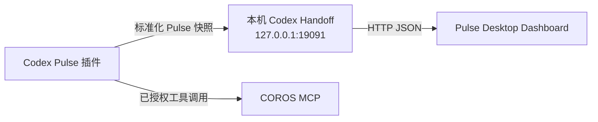

# Pulse 桌面看板与 Codex 交接约定

Pulse 的产品主体是桌面数据看板，不是另一个 COROS 账号客户端。Codex 负责调用已授权的 COROS MCP 工具、整理数据并生成训练建议；Pulse 负责把该结果渲染为常驻桌面的健康、训练和计划卡片。

当前标准化快照版本为 v2；v2 增加显式 `readiness`、发布时间新鲜度和集合上限。旧版完整快照仍可降级显示为 `data_insufficient`，但必须按 v2 规则重新发布后才能覆盖桌面数据。



## 当前已实现的交接链路

1. 在 Codex 中使用 `pulse-dashboard` 插件获取当天 COROS 数据，并生成完整的标准化快照。
2. 插件只将该快照发布到本机回环地址；不会把 COROS 凭据、原始登录信息或 Token 传给 Electron。
3. 桌面版在启动后运行本机 Handoff，并在选择“Codex + COROS MCP”数据源时读取该快照、缓存并渲染卡片。
4. Handoff 接受新快照后会通知当前窗口立即重读，因此发布成功后不需要再手动点击刷新。

Handoff 默认监听 `http://127.0.0.1:19091`，不监听局域网地址。桌面端首次启动时为当前 Windows 用户生成随机 Handoff 令牌；客户端先用一次性随机挑战校验服务身份证明，再携带 Bearer 令牌访问快照接口。因此，其他进程即使抢占固定端口，也不能伪造 Pulse 身份后取得快照。快照应通过 Pulse 的 Node 发布脚本以 `application/json; charset=utf-8` 提交；交接层会拒绝浏览器来源写入、未认证请求、明显乱码、占位零值和不完整活动。

桌面端将 Handoff 与离线回退合并为一份加密快照存储，通过 Electron `safeStorage` 使用 Windows 当前用户的系统加密能力。设置中可选择 1、7 或 30 天留存，也可二次确认后一键清除。源码开发用的独立 Node Handoff 只在内存中保存快照。

| 接口 | 用途 |
|---|---|
| `GET /api/health?challenge=...` | 返回 HMAC 服务身份证明；携带 Bearer 令牌时同时返回快照就绪状态。 |
| `POST /api/snapshot` | 由已认证的 Codex 插件发布完整标准化快照。 |
| `GET /api/snapshot?timezone=...` | 供已认证的 Pulse Desktop 读取当前快照。 |
| `POST /api/insight` | 向已认证的 Pulse Desktop 返回快照中的训练建议和标签。 |

快照必须含有 `health`、`todayActivities`、有效 `meta.asOf` / `meta.lastUpdated` / `meta.timezone` 和显式 `readiness`；字段缺失会按现有快照归一化规则显示为空值，不应伪造成 `0`。新发布快照的 `lastUpdated` 必须在最近 36 小时内，不能位于未来；旧快照仍可作为带时间标记的显示/离线数据读取，但不能重新冒充即时发布结果。

为避免凌晨或设备尚未归档时把“最近有效值”误写成“今日值”，健康指标可以携带独立日期：

```json
{
  "health": {
    "sleep": { "durationMinutes": 357, "score": 83, "date": "2026-07-26" },
    "restingHeartRate": { "value": 51, "trend": -1, "date": "2026-07-26" },
    "hrv": { "value": 94, "status": "above_normal", "date": "2026-07-26" },
    "stress": { "value": 32, "unit": "score", "date": "2026-07-27" },
    "steps": { "value": 40, "date": "2026-07-27" },
    "recovery": { "value": 99, "level": "heavy_training_allowed", "date": "2026-07-27" }
  }
}
```

看板会对早于快照日期的指标显示其日期，不把旧值冒充成当天新值。训练计划同样可用 `plan.date` 标记课表所属日期。

日均压力优先显示在次要健康卡片中，值域按 COROS 原始分数显示为 0–100，不在桌面端自行诊断或推断；若快照未提供 `health.stress`，该卡片回退显示血氧，保持旧快照兼容。

最近七日负荷使用按日期升序排列的 `trends.trainingLoad`：

```json
{
  "trends": {
    "trainingLoad": [
      { "date": "2026-07-21", "shortTerm": 61, "longTerm": 64, "ratio": 0.95, "comment": "Maintaining" },
      { "date": "2026-07-27", "shortTerm": 71, "longTerm": 66, "ratio": 1.07, "comment": "Optimized" }
    ]
  }
}
```

对于 Codex 自动同步，发布前还必须满足：至少两项有效健康指标；若活动有距离，则必须包含正的时长；今日活动、标签和逐日负荷分别不得超过 32、8 和 31 条。洞察若存在必须基于数据且编码正常；洞察缺失或损坏时只清空洞察，不阻断已经通过校验的客观数据。其他质量条件不满足时，Handoff 会拒绝该快照并保留上一次有效数据。

训练建议安全状态使用：

```json
{
  "readiness": {
    "status": "data_insufficient",
    "confidence": "low",
    "recommendationLevel": "informational",
    "reasons": ["尚未确认当前主观疲劳与安全状态"],
    "subjective": {
      "collectedAt": null,
      "fatigue": null,
      "soreness": null,
      "pain": null,
      "illness": null,
      "chestSymptoms": null,
      "dizziness": null
    }
  }
}
```

- 只刷新客观数据时允许 `data_insufficient`，看板照常更新，但只能给信息说明或休息建议，不能给任何训练强度。
- 只有最近 36 小时内完整确认疲劳、酸痛、疼痛、疾病、胸部症状和头晕，且安全项均为否时，才允许 `ready` 与轻松/中等/高强度建议。
- 疼痛、胸部症状或头晕触发 `stop_refer`，它覆盖正常的恢复、HRV 或负荷指标；输出停止训练与按严重程度寻求合适专业评估的安全提醒，不进行诊断。

## 责任边界

| 层级 | 负责内容 | 不负责内容 |
|---|---|---|
| Codex + COROS MCP | 授权会话、工具调用、数据清洗、训练建议。 | 为 Pulse 保存 COROS 密码或 Token。 |
| Pulse Codex 插件 | 生成规范化快照，并在本机可用时发布给 Handoff。 | 向网络上的第三方传输健康快照。 |
| Pulse Desktop Dashboard | 显示、刷新、缓存和离线回退。 | 直接调用 COROS API 或继承 Codex 的工具权限。 |

## 当前限制与下一步

本版本已经实现“Codex 生成真实数据 → 桌面卡片展示”的闭环：每次在 Codex 中刷新 Pulse 快照后，插件会发布新快照，桌面版会自动显示。右上角按钮只用于手动重读本机结果。

它暂时不是完全无任务痕迹的后台 MCP 查询：Electron 不能自行取得 Codex 的 MCP 权限，也不会绕过宿主自动调用 COROS。Codex 计划任务会留下独立运行记录，项目默认保持停用。下一阶段是在宿主明确支持的边界内继续降低交互成本，而不是开发独立 COROS OAuth。

## 隐私与故障回退

- Handoff 只接收本机回环地址的请求，发布脚本会拒绝非 `localhost` / `127.0.0.1` 的地址。
- 固定端口使用随机挑战/HMAC 证明服务身份，API 使用当前用户随机 Bearer 令牌；写入接口要求 JSON，并拒绝带浏览器 `Origin` 的请求。
- 桌面端快照使用 Windows 系统加密能力保存，不提供明文回退；自定义 Bridge 同样限制在本机回环地址。
- 日志不记录完整健康数据、活动坐标、Token 或原始活动标识。
- 无新快照时，桌面版仅保留相同 provider 的上一次有效缓存；若没有同源缓存，则展示全部指标不可用的等待同步状态，绝不回退合成 Demo 数字。
- AI 训练建议仅作训练参考，不构成医疗建议。

更完整的数据保存说明和攻击边界见 [隐私说明](PRIVACY.md) 与 [本地威胁模型](THREAT_MODEL.md)。
