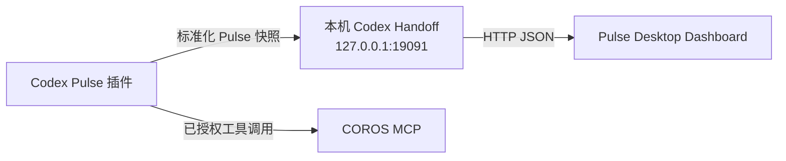

# Pulse 桌面看板与 Codex 交接约定

Pulse 的产品主体是桌面数据看板，不是另一个 COROS 账号客户端。Codex 负责调用已授权的 COROS MCP 工具、整理数据并生成训练建议；Pulse 负责把该结果渲染为常驻桌面的健康、训练和计划卡片。

## 当前已实现的交接链路

1. 在 Codex 中使用 `pulse-dashboard` 插件获取当天 COROS 数据，并生成完整的标准化快照。
2. 插件只将该快照发布到本机回环地址；不会把 COROS 凭据、原始登录信息或 Token 传给 Electron。
3. 桌面版在启动后运行本机 Handoff，并在选择“Codex + COROS MCP”数据源时读取该快照、缓存并渲染卡片。
4. Handoff 接受新快照后会通知当前窗口立即重读，因此发布成功后不需要再手动点击刷新。

Handoff 默认监听 `http://127.0.0.1:19091`，快照仅落在当前 Windows 用户的应用数据目录中。它不监听局域网地址。快照应通过 Pulse 的 Node 发布脚本以 `application/json; charset=utf-8` 提交；交接层会拒绝浏览器来源写入、明显乱码、占位零值和不完整活动，并使用同目录临时文件原子替换快照，防止把损坏文本或残缺数据写入看板缓存。

| 接口 | 用途 |
|---|---|
| `GET /api/health` | 查询 Handoff 是否已启动，以及是否已有已发布的快照。 |
| `POST /api/snapshot` | 由 Codex 插件发布完整的标准化快照。 |
| `GET /api/snapshot?timezone=...` | 供 Pulse 读取并展示当前快照。 |
| `POST /api/insight` | 返回快照中已生成的训练建议和标签。 |

快照必须至少含有 `health` 或 `todayActivities`；字段缺失会按现有快照归一化规则显示为空值，不应伪造成 `0`。

对于 Codex 自动同步，发布前还必须满足：至少两项有效健康指标、非空且基于数据的训练洞察；若活动有距离，则必须包含正的时长。任一条件不满足时，Handoff 会拒绝该快照并保留上一次有效数据。

## 责任边界

| 层级 | 负责内容 | 不负责内容 |
|---|---|---|
| Codex + COROS MCP | 授权会话、工具调用、数据清洗、训练建议。 | 为 Pulse 保存 COROS 密码或 Token。 |
| Pulse Codex 插件 | 生成规范化快照，并在本机可用时发布给 Handoff。 | 向网络上的第三方传输健康快照。 |
| Pulse Desktop Dashboard | 显示、刷新、缓存和离线回退。 | 直接调用 COROS API 或继承 Codex 的工具权限。 |

## 当前限制与下一步

本版本已经实现“Codex 生成真实数据 → 桌面卡片展示”的闭环：每次在 Codex 中刷新 Pulse 快照后，插件会发布新快照，桌面版会自动显示。右上角按钮只用于手动重读本机结果。

它暂时不是完全无任务痕迹的后台 MCP 查询：Electron 不能自行取得 Codex 的 MCP 权限，也不会绕过宿主自动调用 COROS。Codex 计划任务会留下独立运行记录，项目默认保持停用。下一阶段是在宿主明确支持的边界内继续降低交互成本，而不是开发独立 COROS OAuth。

## 隐私与故障回退

- Handoff 只接收本机回环地址的请求，发布脚本会拒绝非 `localhost` / `127.0.0.1` 的地址。
- 写入接口要求 JSON，拒绝带浏览器 `Origin` 的请求；自定义 Bridge 同样限制在本机回环地址。
- 日志不记录完整健康数据、活动坐标、Token 或原始活动标识。
- 无新快照时，桌面版会明确提示 Codex 快照尚未发布，并保留上一次有效缓存。
- AI 训练建议仅作训练参考，不构成医疗建议。
