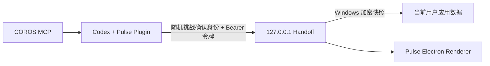

# Pulse 本地威胁模型

## 保护目标

Pulse 重点保护三类内容：标准化健康与训练快照、Handoff 写入权限，以及看板显示的数据来源身份。目标是避免网络暴露、普通浏览器页面写入、固定端口被无关进程冒充、磁盘上的明文健康缓存，以及过期数据无限保留。

## 信任边界

- COROS 授权与 MCP 工具调用属于 Codex 宿主，不进入 Pulse Desktop。
- Handoff 只监听 `127.0.0.1`，拒绝非本机 Host、浏览器 `Origin` 和未认证 API 请求。
- 客户端先发送随机挑战并校验 HMAC 身份证明，确认固定端口上的服务持有当前用户令牌后，才发送 Bearer 令牌或健康快照。
- Renderer 通过 `pulse-app://dashboard` 自定义协议加载，协议仅放行五个打包页面资源；同时启用上下文隔离、沙箱和收紧的内容安全策略，主进程只接受来自精确入口地址的 IPC。
- Electron 会话默认拒绝通知、媒体、设备等权限请求；Preload 事件订阅不会把 `IpcRendererEvent` 暴露给 Renderer。
- 快照使用 Windows 当前用户的系统加密能力持久化；独立 Node 开发服务器只保存在内存中。
- 打包版关闭 `RunAsNode`、`NODE_OPTIONS` 和命令行调试入口，启用 Cookie 加密、嵌入式 ASAR 完整性校验并只从 ASAR 加载应用代码。

## 已覆盖的风险

| 风险 | 控制 |
|---|---|
| 局域网或公网访问 | 只监听回环地址，并校验 Host。 |
| 浏览器跨站写入 | 拒绝任何带 `Origin` 的 Handoff 请求。 |
| 其他进程抢占固定端口 | 随机挑战 + HMAC 服务身份证明；验证失败时不发布快照。 |
| 未授权读取或覆盖 | 所有快照与洞察 API 要求当前用户随机 Bearer 令牌。 |
| 明文健康缓存 | Windows `safeStorage` 加密信封；不提供明文回退。 |
| 无限期保留 | 1 / 7 / 30 天留存和一键清除。 |
| Renderer 扩大权限 | 沙箱、上下文隔离、严格 IPC 来源校验、禁用外部打开接口。 |
| `file://` 页面读取任意本机文件 | Renderer 改用标准、安全的 `pulse-app://` 协议；处理器只映射五个固定打包资源，未知路径和非 GET 请求均拒绝。 |
| Electron 命令行/环境变量改写 | 打包 Fuse 禁用 Node 运行模式、`NODE_OPTIONS` 与调试参数，并强制 ASAR 完整性。 |
| 自定义 Bridge 获取完整快照 | 只允许回环读取，不向未认证的自定义 Bridge POST 快照或请求洞察。 |

## 明确不覆盖

- 已经控制当前 Windows 账户、读取当前进程内存或注入 Pulse/Codex 进程的恶意软件。
- 操作系统、Electron、Codex、COROS MCP 或用户安装的第三方插件本身被攻破。
- 用户主动复制、截图、备份或上传健康数据后的二次传播。
- COROS 与 Codex 服务侧的数据处理；应分别遵循对应服务的隐私政策。

## 失效方式

- Windows 安全存储不可用时，Pulse 不写入明文快照，真实数据模式显示不可用状态。
- Handoff 身份证明不匹配时，桌面和发布脚本都停止通信，并提示固定端口可能被占用。
- 快照损坏、过期或未通过质量门时，Handoff 拒绝覆盖有效数据；没有可用同源数据时显示等待同步，不回退 Demo 数值。
